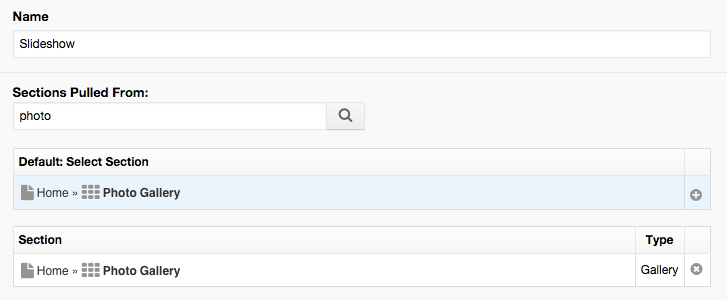
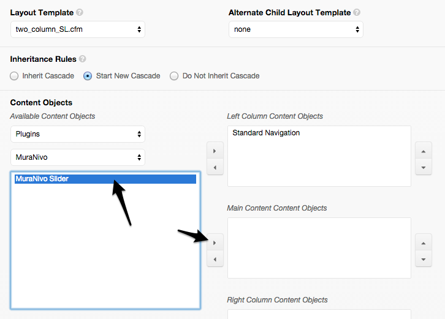
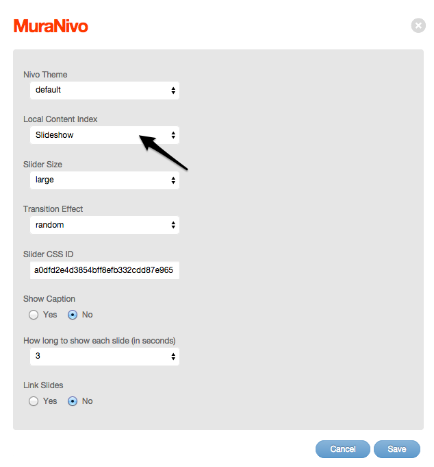
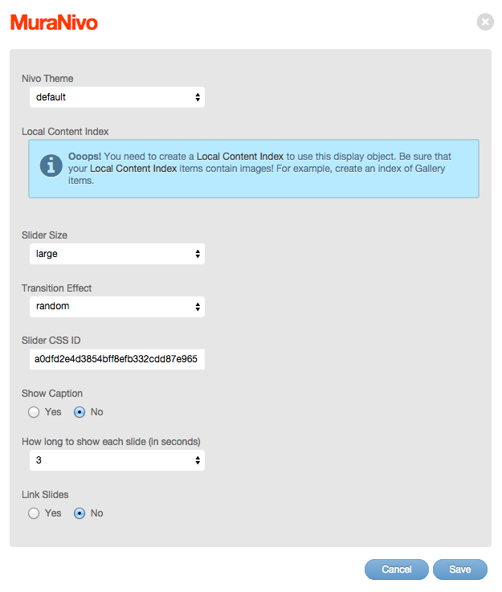
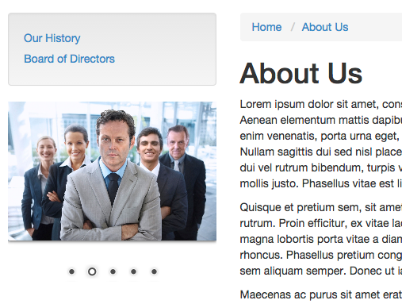

#MuraNivo TM

MuraNivo is a Mura CMS plugin that utilizes [Nivo Slider](http://nivo.dev7studios.com/) to create configurable slide show display objects.

##How To

**NOTE:** Before using this plugin, you will need to create a [Local Content Index](http://docs.getmura.com/v6/content-managers/building-the-home-page/content-collections/local-content-indexes/). Your content collection should contain content items which have Primary Associated Images assigned to them. For example, most 'News' items typically have a Primary Associated Image. You may simply wish to create a content collection of a Mura Gallery, which is perfectly suited for this plugin.

Once a [Local Content Index](http://docs.getmura.com/v6/content-managers/building-the-home-page/content-collections/local-content-indexes/) has been created, simply follow the remaining steps below.

* From the **Site Manager**, select any content item to edit it (e.g., the 'About Us' page)
* Go to **Layout & Objects** tab
* From the **Available Content Objects** select menu, choose **Plugins**
* From the **Select Plugin** select menu, choose **MuraNivo**
* In the list of display objects, click **MuraNivo Slider** and assign it to your desired display region
  
* The **MuraNivo** configurator will open
	* Select a **Nivo Theme**
	* If you have created any Local Content Indexes, choose one of them from the **Local Content Index** select menu
    
  * If you have *not* created a Local Content Index, you will see a notice informing you to do so
    
	* Choose your desired **Slider Size**. If your site has any custom-defined image sizes, the name will appear in the list.
	* Select a **Transition Effect**
	* If you wish to use your own CSS ID, enter that in the **Slider CSS ID** text field. This ID will create a wrapper as: **yourCSSID-wrapper**. In addition, the ID will be used with the slider itself.
	* If you wish to display captions, select **Yes** for **Show Caption**. If selected, the content node's Title and Summary will appear in a caption area if any text has been entered in the Summary field.
	* Select your **How long to show each slide (in seconds)**.
	* If you wish to output the links for each slide, select **Yes** for **Link Slides**. If selected, each slide will be wrapped with its URL.
  * When finished, you should see your MuraNivo slider appear in the region you specified
    

##Responsive-ness

**Just so you know** ... Nivo Slider is a responsive slider, and as such, the slider will automatically attempt to fill the entire width of its outer container. So if you select 'small' for the image size and assign it to the main content area of a one_column.cfm layout template, due to the responsive-ness going on, scaling of the image will occur. You may want to either use custom and put your own height and width in, or create a custom image size by going to **Site Config** > **Edit Site**, then selecting the **Images** tab.

##Tested With

* Mura CMS Core Version 6.2+
* Adobe ColdFusion 11.0.3
* Lucee 4.5.1.000

##License
Copyright 2013-2015 Stephen J. Withington, Jr.

Licensed under the Apache License, Version 2.0 (the "License"); you may not use this work except in compliance with the License. You may obtain a copy of the License in the LICENSE file, or at:

http://www.apache.org/licenses/LICENSE-2.0

Unless required by applicable law or agreed to in writing, software distributed under the License is distributed on an "AS IS" BASIS, WITHOUT WARRANTIES OR CONDITIONS OF ANY KIND, either express or implied. See the License for the specific language governing permissions and limitations under the License.